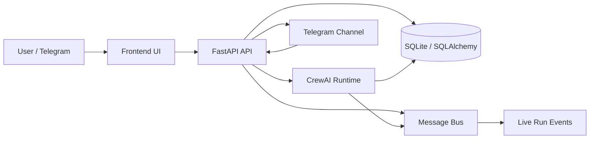

# AI Agent Orchestration Platform

## Live Demo

- [Working end-to-end demo](https://drive.google.com/file/d/16CWTLWEgDY4S8S46XYt0LMuNWPPJDR32/view?usp=sharing)
- [AIAgent-Orchestrator bot](https://web.telegram.org/a/#8607688418)
- [Deployed Space](https://huggingface.co/spaces/Pankaj10346/AI-Orchestrator)

This repository implements a local-first AI agent orchestration platform with:
- Agent CRUD and configuration
- Visual workflow execution
- Persistent message history and audit trail
- Telegram integration for external interaction
- Real runtime execution using CrewAI
- Live monitoring hooks for workflow runs

## Deployed App

Live Hugging Face Space:
[https://huggingface.co/spaces/Pankaj10346/AI-Orchestrator](https://huggingface.co/spaces/Pankaj10346/AI-Orchestrator)

## Why this stack

- **Backend:** FastAPI for a clean API layer and async workflow execution.
- **Agent runtime:** CrewAI, because the challenge explicitly requires a real runtime and the code already uses tool-aware agent execution rather than a UI mock.
- **Persistence:** SQLAlchemy with SQLite for local-first setup and simple evaluation portability.
- **Frontend:** React + Vite + React Flow for a visual workflow builder and run monitoring UI.
- **Channel integration:** Telegram, because the challenge requires at least one external messaging channel and Telegram is easiest to validate locally.

## Challenge Coverage

This section maps the implementation to the rubric the reviewer will likely use.

### Functional requirements

- **Agent CRUD:** implemented in the backend API and model layer.
- **Agent configuration:** name, role, system prompt, model, tools, channels, memory, guardrails, and schedules are represented in the schema.
- **Visual workflow builder:** frontend workflow builder exists with workflow node/edge support and conditional routing.
- **At least 2 pre-built workflow templates:** seeded during app startup.
- **External channel integration:** Telegram channel support is implemented and can be connected to an agent.
- **Live monitoring:** workflow runs publish events, persist message history, and track completion metadata such as tokens/cost estimates.
- **Working end-to-end demo:** the code path exists for multi-agent workflow execution and channel interaction, with a recorded demo here: [Working end-to-end demo](https://drive.google.com/file/d/16CWTLWEgDY4S8S46XYt0LMuNWPPJDR32/view?usp=sharing)

### Code quality standards

- **Separation of concerns:** UI, runtime, messaging, persistence, and orchestration are split into dedicated packages.
- **Tests for critical paths:** the backend test suite covers agents, workflows, messaging, audit trail, and integration flows.
- **Documentation:** setup and deployment notes are included below, with concise runtime justification.
- **Adding new templates or channels:** the workflow templates and channel manager are the extension points.

## Architecture



## Local Run

### Quick start

```bash
git clone <repo-url>
cd ai-orchestrator
copy .env.example .env
```

Fill in the environment variables you need, then run:

```bash
docker build -t ai-orchestrator .
docker run --rm -p 8000:8000 -p 3000:3000 ai-orchestrator
```

## Environment

Key variables:
- `LLM_PROVIDER`: `openai` or `ollama`
- `OPENAI_API_KEY`: required when `LLM_PROVIDER=openai`
- `TELEGRAM_BOT_TOKEN`: enables the Telegram integration
- `ENABLE_TELEGRAM_POLLING`: useful for local bot testing
- `DATABASE_URL`: SQLite by default for portability

Important:
- Do not commit secrets to the repository.
- If a token was ever placed in a tracked file, rotate it before submission.

## Run Flow

1. Create or load agents.
2. Build a workflow in the UI.
3. Trigger a workflow run.
4. The runtime executes the configured agent logic.
5. Messages, run status, and audit events are persisted.
6. Telegram can be used as an external conversational entry point.

Telegram chat demo:
[AIAgent-Orchestrator bot](https://web.telegram.org/a/#8607688418)

## Tests

The backend test suite is the best proof that the implementation is real:

```bash
pytest backend/tests
```

## Submission Checklist

- README reflects the actual architecture and runtime choice.
- Local setup is documented.
- Telegram flow is described.
- Workflow templates are mentioned.
- Demo recording is attached before final submission: [Working end-to-end demo](https://drive.google.com/file/d/16CWTLWEgDY4S8S46XYt0LMuNWPPJDR32/view?usp=sharing)

## Next step for strongest shortlist odds

The submitted demo recording shows:
- creating an agent
- connecting Telegram
- launching a workflow with 2+ agents
- viewing persisted messages and run events
